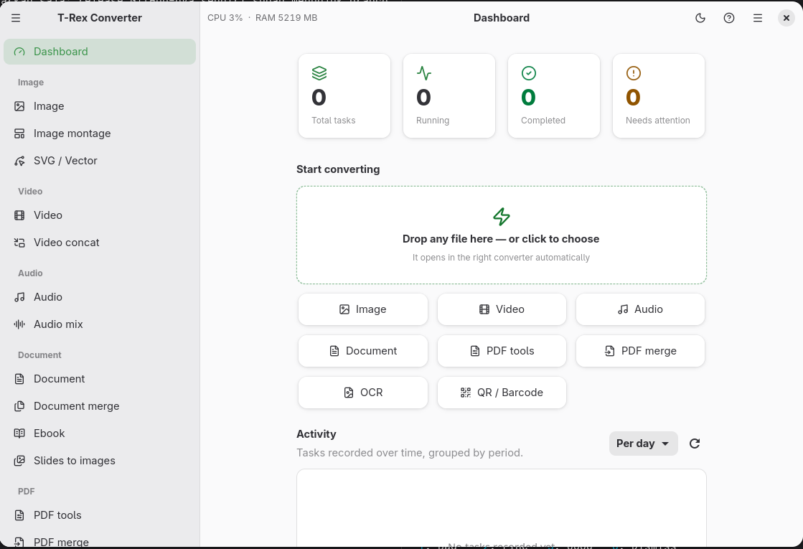

# T-Rex Converter

A native **GTK4 / libadwaita** app that converts images, video, audio, documents,
PDFs, subtitles, ebooks, and archives — entirely on your machine. It is a single
front-end over best-in-class command-line engines (FFmpeg, ImageMagick,
LibreOffice, Pandoc, Tesseract, PyMuPDF/qpdf, Inkscape, ExifTool, and more),
with an async task queue, presets, and bilingual built-in help.



## Highlights

- **26 converter destinations** in a sidebar, grouped by media family — from
  plain image/video/audio conversion to multi-input jobs (video concat, audio
  mix, image montage, PDF/document/subtitle merge) and utilities (OCR, QR,
  archives, metadata).
- **Dashboard as a home base** — drop any file on the quick-convert card and it
  opens in the right converter automatically; shortcut chips, task history with
  open-folder buttons, an activity chart, and a live engine-availability panel.
- **Task queue** — live progress, cancel/retry, per-task details with engine
  logs, and a persistent history that resumes pending tasks across restarts.
- **Presets per page**, a persisted light/dark theme toggle, CPU/RAM readout,
  and built-in help in English and Bahasa Indonesia.
- **Local-only processing** — nothing ever leaves your machine.

## Install (Fedora 41+)

Grab the RPM from the [latest release](https://github.com/s4rt4/trex-converter/releases):

```bash
sudo dnf install ./t-rex-converter-*.noarch.rpm
```

The conversion engines are *soft* dependencies (`Recommends`) — the app runs
without them and the Dashboard shows which ones are available. For video/audio
you also need **ffmpeg**, which is intentionally not auto-installed (Fedora
ships `ffmpeg-free`; [RPM Fusion](https://rpmfusion.org) ships the full
`ffmpeg` — pick one):

```bash
sudo dnf install ffmpeg-free        # or: ffmpeg (RPM Fusion)
```

## What it converts

| Family | Highlights |
| --- | --- |
| **Image** | Any↔any across png/jpg/webp/avif/heic/gif/tiff/bmp/ico + resize, crop, color, filters, borders, watermarks, metadata strip; montage; SVG render & bitmap trace |
| **Video** | mp4/mkv/webm/mov + trim, transform, compress (CRF/target size), watermark/logo, GIF & animated WebP, thumbnail sheets, subtitle burn-in; concat |
| **Audio** | mp3/wav/flac/m4a/opus/ogg + trim, fade, loudness normalize, vocal remove, ID3 tags; multi-track mix; extract audio from video |
| **Document** | LibreOffice matrix: docs/sheets/slides ↔ docx/odt/xlsx/pptx/pdf/html/epub…, PDF/A, password-protected PDF, slides → images; merge to PDF |
| **PDF** | Convert to png/jpg/txt/html/docx/epub; extract/reorder/rotate pages, compress, encrypt/decrypt, watermark, redact, page numbering, split, compare, extract images/attachments |
| **More** | OCR (searchable PDF/txt/hOCR), ebooks via Pandoc, QR generate/decode, archive extract/compress, media metadata read/strip/edit |

## Run from source

Requires Python ≥ 3.11 with GTK 4.14+ / libadwaita 1.6+ (Fedora:
`sudo dnf install gtk4 libadwaita python3-gobject python3-pymupdf python3-psutil`).

```bash
git clone https://github.com/s4rt4/trex-converter.git
cd trex-converter
./run-gtk.sh                 # or: PYTHONPATH=. python3 -m app.gtk_main
```

If you use a virtualenv, create it with `--system-site-packages` (or set
`include-system-site-packages = true` in `pyvenv.cfg`) so the distro's
PyGObject is visible inside it.

Useful dev scripts:

```bash
packaging/build-rpm.sh       # build the RPM (artifacts in build/rpm/RPMS)
packaging/install-dev.sh     # install a dev .desktop entry + icons for GNOME
scripts/generate-icons.sh    # regenerate PNG icons from the SVG logo
```

## Engine dependencies

Each feature degrades gracefully when its engine is missing; the Dashboard's
**Engines** panel shows live availability. Fedora package names:

```bash
sudo dnf install ImageMagick libreoffice-writer libreoffice-impress \
    libreoffice-calc qpdf tesseract pandoc qrencode zbar inkscape \
    potrace perl-Image-ExifTool
```

(Debian/Ubuntu equivalents: `imagemagick libreoffice qpdf tesseract-ocr
pandoc qrencode zbar-tools inkscape potrace libimage-exiftool-perl`.)

## Branches

- **`gtk4`** — the current 2.x line: GTK4/libadwaita UI (this README).
- **`main`** — the legacy 1.x line: PySide6/Qt UI packaged for Debian
  (`packaging/build-deb.sh`). The two share the same engine backend but are
  released separately.

## License

MIT — see `packaging/debian/copyright`.
